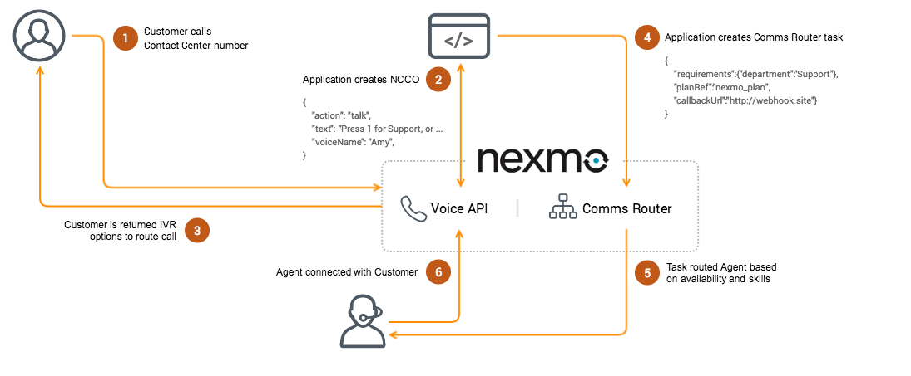

# Introduction to Comms Router
The Nexmo Comms Router API enables businesses to leverage self-hosted or on premises APIs to manage Contact Center task management. The modern Contact Center is designed to be flexible and extensible through allowing developers to customise integrations and leverage Nexmo Comms Router API as a key building block.

Comms Router is a key building block within the Contact Center complete solution. 

This repository also includes:
* A [Demo Application](applications/demo/README.md) to show how to apply the API in a Contact Center use case.
* A [Graphical User Interface Application](applications/gui/README.md) to enable admins to manage agents.

## Pre-requisites
* Nexmo Account https://dashboard.nexmo.com/sign-up
* Nexmo Phone Numbers https://developer.nexmo.com/account/guides/numbers
* Nexmo Voice API https://developer.nexmo.com/voice/voice-api/overview
* Nexmo Comms Router API installed

## Key Concepts
* *Router* - The parent container that joins all of the Router entities Tasks, Agents, Queues and Plans.
* *Plans* - Container that manages multiple queues, priority of Tasks in Queues and failover if agents are not available.
* *Queues* - A bucket to collect Tasks waiting for the next available Agent. The Task is routed to a Queue based on conditional logic (predicate) predefined by the Customer requirements for example if they require to be routed to speak to an agent with a specific skill like language.
* *Agents* - An endpoint for a physical Agent able to handle Tasks, characterized by their Capabilities or assigned skills it has based on key value pairs set.
* *Capabilities (Skills)* - Conditional logic assigned to Agents and Queues to route Tasks. These are made of key value pairs or arrays, single or multiple value conditions.
* *Tasks* - A work item characterized by its Capabilities for example a set of skills an Agent requires to have a Task routed to them based on key value pairs set.
* *Customer* - End user that is initiating the contact request, creating the Task that is then routed to an Agent via a Queue.
  
## Features
* Agent capabilities can be text, numeric integers or ranges, boolean key value pairs or an array of strings.
* Agent availability can be set to `offline`, `ready`, `busy`, `unavailable` and is updated to `busy` based on if a Task has been assigned to them.
* Within the Plans it is possible to manage priority order of Queues, priority of a Task and timeout of a Task to enable failover to another Queue.

# Customer Journey Flows

## Inbound Voice Call (PSTN):
Can be set up using the current [demo application](applications/demo) for an inbound Contact Center use case.

1. Customer calls Nexmo phone number
2. Client receives a request via Webhook and NCCO request with predefined IVR options
3. Client receives IVR option from Voice API
4. Comms Router Task created from client
5. Available Agent found with matching criteria
6. Agent accepts request and Customer connected to Agent

## Callback Voice Call (PSTN):
Require creating a custom application to handle the inbound request and a client for connecting an Agent to a Customer through a PSTN call. [View documentation](https://developer.nexmo.com/voice/voice-api/building-blocks/make-an-outbound-call) for creating an outbound Voice application.

1. Customer submits an online callback request form
2. Form submitted to the server application
3. Task is created with routing requirements from customer request
4. Available Agent is found with matching skills
5. Agent accepts reservation and dials customer phone number (PSTN)
6. Call is initiated and connects the Agent to the customer

## Agent Management and Real-Time Tasks Dashboard:
Manage Agents availability, phone numbers, Skills, Queues and Plans within a Dashboard web UI application. View tasks associated with Queues in real-time and manage Skills of Agents and their availability.

# Installation
Before installation, you’ll need the following from the [Nexmo Dashboard](https://dashboard.nexmo.com/sign-in). If you need to create an account [sign up for a Nexmo](https://dashboard.nexmo.com/sign-up).

* Your [Nexmo API key and API](https://dashboard.nexmo.com/settings) secret which can be found on the Dashboard.
* A Nexmo phone number, either [purchase one](https://dashboard.nexmo.com/buy-numbers) or you can use a number you have [already purchased](https://dashboard.nexmo.com/your-numbers).
* Create a [Nexmo Call Control Object](https://developer.nexmo.com/api/voice/ncco) (NCCO) with capabilities mapping to the IVR.
* Enable a webhook for capturing events from your Voice Application during calls (this is optional).
* Create a [Nexmo Voice Application](https://dashboard.nexmo.com/voice/create-application) to link your number, NCCO and webhook.

**Note:** It is recommended that you have an upgraded Nexmo account with credit before installation.

## System requirements
* Java - Oracle JDK/JRE 8 (build/runtime)
* Apache Maven - 3.5 (build)
* SQL Server - MySQL 5.7 (runtime)
* Java Servlet Container - Tomcat 8 (runtime)

The Comms Router API may work with different types of Java, SQL Server or Web Container and is currently being tested and maintained with the above component versions.

## Install and build
1. Install Java - Oracle JDK/JRE 8 (build/runtime)
2. Install SQL Server - MySQL 5.7 (runtime)
3. Installing SQL Server and configuring Tomcat: ([view complete guide](docs/ConfiguringDatabaseAccess.md))
	- Create and `context.xml` configure `context.xml` datasource resource definition
	- Install the Java Database Controller (JDBC) driver
	- Update or create `setenv` file
	- Create new `liquibase.properties` file
	- Populate and migrate the database
4. Clone Comms Router repository
5. Install Maven:
	- Navigate to local repository `cd comms-router/`
	- Run Maven install `mvn install`
8. Build application:
	- Navigate to `web/target/`
	- Deploy application to Tomcat `mv comms-router-web.war /usr/local/apache-tomcat-8.0.XX/webapps/`

**Note:** Depending on Tomcat settings this can be done by simply copying it to the Tomcat's webapps directory.

## Test installation
1. Start Tomcat
2. List routers `curl -X GET http://localhost:8080/comms-router-web/api/routers`

## Supporting documentation
* [Getting Started Guide](docs/GettingStartedGuide.md) for quick start.
* Predicate [expression guide](docs/ExpressionSyntax.md) for Skills, Agents and Queues.
* Set up of [database access and Tomcat configuration](docs/ConfiguringDatabaseAccess.md).
* How to [manage database migrations](docs/ManageDBMigrations.md).
* OpenAPI spec on localhost http://localhost:8080/comms-router-web/swagger-ui.html
